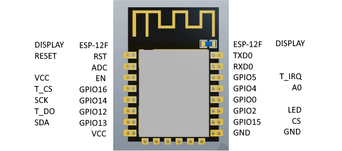
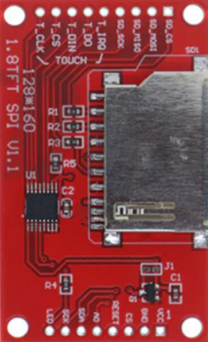

pre.CodeMirror-line {
    line-height: 1.1 !important;
}
# Universal Light Switch

## Hardware

# Parts
* [ESP-12F](https://www.aliexpress.us/item/2251801851082242.html)
* [1.8” TFT display /w touch screen ](https://www.aliexpress.us/item/3256804157566656.html)(includes pin headers and foam separator)
* [85-265VAC to 3.3VDC 700mA Buck Converter](https://www.aliexpress.us/item/2255800650733586.html)
* [3.3kΩ 1/8W resistor](https://www.amazon.com/dp/B01MDJQ1II) (1) (assortment of thousands of resistors) (another value may work just as well)
* [M3 x 10 screws](https://www.aliexpress.us/item/3256805291929158.html) (qty 4) (package of 20)
* [2mm single row straight male header](https://www.amazon.com/gp/product/B012TBLZTC) (2x 8 pins, 2x 1 pin) (package of 18 1x40 pins ea.)
  * (alternative [8 pin headers](https://www.amazon.com/dp/B07J5B9LT5) (qty 2) (pins of headers used as posts for wire wrapping the ESP-12F)
* [Compact Electrical Cable Terminal Block](https://www.aliexpress.us/item/3256804992243238.html) (qty 2) (package of 34)
* [Heat shrink tubing, 1mm diameter](https://www.amazon.com/Uxcell-a11110900ux0075-Shrinkable-Shrink-Tubing/dp/B00843KWKS/ref=sr_1_3)
* [3D printed enclosure](https://drive.google.com/file/d/1mrjO87gIkhDF_7CDPRVbjMBAb8dsjzF4/view?usp=drive_link) 
    The STL file for the 3D model is provided.  The printing of this enclosure is up to the builder.

#### 3D printed enclosure design notes
* 4 parts: Mount Plate, Box, TFT Tray, and Decora Filler (2x).
* The TFT display sits on top of the 4 bosses of the TFT Tray
* The Decora Filler provides a flush surface and covers the back side of the headers
* The M3-10 screws go through the holes of the bosses and screw into the Decora Filler.  The screws cut the threads of the Decora Filler
* The Box sides are open to provide for the conductors from the TFT display to the ESP-12F
* The Box and the TFT Tray have external detents which will match the internal detents of the Mount Plate
* The Box and TFT Tray slide into the Mount Plate and are held in place by the detents.  This sets the TFT display and Decora Fillers flush with a standard Decora wall plate
* The manufacturing tolerances of the TFT display are very loose; that is there will probably be alignment problems.
* The ESP-1F will be held in place with the foam separator that comes with the TFT display
* The hole at the bottom of the Box aligns with the AC inputs to the Buck Converter.  The 20 AWG wire will be fed through the bottom of the Buck Converter and solder on the top of the Buck Converter’s PCB
* Compact Electrical Cable Terminal Block will be ~~super glued~~ double stick taped to the outside  (super glue does not adhere to the case)

## Consumables
* [Solder](https://www.aliexpress.us/item/3256805477891963.html)
* [30 AWG Wire wrap wire](https://www.aliexpress.us/item/2251832847284079.html)
* Cyanoacrylate (super glue)
* [20 AWG hookup wire](https://www.amazon.com/Silicone-Electric-Cable-Colors-WYEUTO/dp/B089SR96HN/ref=sr_1_6) 
* Heat shrink tubing
* bottom of the Box

# Tools

* Soldering station
* Heat gun
* Wire wrap tool
* Needle nose pliers
* Exacto knife

# Construction

**It is assumed that the builder has the skills to use all of the tools.**

1. Build the 3D printed box
2. TFT display preparation
    1. Solder the 8 and 9 pin headers to the TFT display such that the headers are away from the face of the display.
    2. With the wire wrap wire, connect:
        1. SCK to T_CLK
        2. SDA to T_DIN
    3. Create a solder blob that jumpers J1 which changes the power source for TFT display from 5V to 3.3V
3. Build the display assembly
    1. Place the prepared TFT display on the bosses of the TFT tray.
    5. Feed the M3-10 screws through the bottom of the TFT tray and screw into the Decora Fillers (4x).  The screws are sufficiently in place when both gaps, display/tray and display/filler, have been closed.  Do not tighten beyond this!
4. Prepare the ESP-12F.  This is challenging.  The goal is to put the header on and still be able to use the development frame.  There are two considerations.  First, the connection cannot extend below the ESP-12F.  Second, the side connectors cannot be filled with solder because the contact of the frame will have no contact notch into which it needs to be guided.
    1. Program the ESP-12F.  The program has over-the-air (OTA) update capability so if success is not achieved here, the board is still usable.
    7. From the header strip, cut off 2 eight pin headers
    8. Place the headers
        1. Place the ESP-12F on a hard, durable surface, one that will not be marred by the header pins pushing into it. 
        4. Put one of the headers into the holes on one side.
        5. The goal here is to push the plastic spacer of the header to the surface of the ESP-12F.  With a knife, across all of the spacers of all of the pins, gently, but firmly, maybe rocking, push the spacers down.  The goal has been reached if all of the spacer are touching the board and all of the pins are flush with the bottom of the board
        6. Repeat for the other side.
    9. Touch the hot soldering iron tip to the outside of the hole, between the hole and the header pin
    10. Allow a few seconds for the touch zone to be heated, then touch solder on the inside of the hole between the hole and the header pin
    11. As soon as the solder flows, remove the soldering iron and the solder.
    12. Continue on for each of the rest of the other 15 pins.
    13. Pry the spacers back up so the top of the spacers is just above the surface of the shield of the ESP-12F
    14. If ESP-12F needs to be re-programmed on the frame:
        1. Prying the spacers up allows the pins of the frame to snap into place
        8. Any protrusion from the bottom side of the board must be filed off.  This leaves a dusting of solder and header pin; wipe this off to prevent a short.
        9. Every side connector that was filled with solder must have its solder removed.  I have tried filing with a triangular file which had questionable success, as the file tends to file the PCB and not the solder. I have considered using solder wick, but I don’t have any so this technique needs to be proven
5. Prepare the Buck Converter
    1. From the header strip, cut off two, 1 pin headers
    16. Solder one to the top of the Buck Converter in the hole labeled ‘+’ and one to the hole label ‘-’.  The printing is small and there is an unused hole between them.
    17. Cut a piece of black and one red 20 AWG wire 27mm long.  These lengths are dependent upon the style of terminal blocks being used.
    18. Strip one end of each 8mm and the other end of each 2 mm
    19. The 2mm end of the white wire gets put up through the bottom of the Buck Converter in the hole labeled ‘N’ and solder from the top
    20. The 2mm end of the black wire gets put up through the bottom of the Buck Converter in the hole that is in the corner near the label ‘C2’ and solder from the top
6. Wire wrapping
    1. The 3.3kΩ goes between GPIO15 and GND.  This gets tricky. 
        1. Bend the leads of the resistor parallel at right angles to resistor
        11. Cut two 2mm lengths of 1mm shrink tubing and put them over each lead   
        12. After pushing the tubing all the way to the resistor, bend both leads up at a 90° angle.  
        13. Put a 1mm length of tubing on each of the GPIO15 and GND pins of the header (this is to keep the pins from shorting to the case of the ESP-12F)
        14. Set the resistor on the ESP-12F so that the resistor leads are near the GPIO15 and GND pins and cut the leads to the length of the header pins
        15. Cut a white wire-wrap wire 100mm long and strip both ends 12mm
        16. Wrap the white wire
            1. Feed the stripped white wire-wrap wire into the outer part of the wire wrap tool
            2. Point the tool up and put the lead of the resistor that will attached to the GPIO15 pin into the center hole of the wire wrap tool.
            3. Keeping the tool up, drop the GPIO15 pin into the center hole of the tool
            4. In the pointing up orientation, turn the tool counter-clockwise many times to ensure that the wire is completely wrapped.
        17. Similarly wrap a 100mm long black wire, both ends stripped 12mm, around the other lead of the resistor and the GND pin
        18. Similarly, wrap a second black wire onto the GND pin
        19. Cut two pieces of tubing 8mm long. Slide one down the white wire until the tubing covers the wrapped wire.
        20. Similarly, slide tubing down both black wires until the tubing covers the wrapped wires
        21. Use heat gun to shrink tubing
    22. Wrapping VCC and EN  
        1. Cut a 100mm and a 50 mm length of red wire-wrap wire and strip the ends 12mm
        23. Place 1mm of tubing over the VCC pin
        24. Wrap one end of both wires onto the VCC pin
        25. Push 8mm of tubing over both wires and pin to cover wire wrapping
        26. Put 8mm of tubing over the shorter wire
        27. Wrap the shorter wire on the EN pin
        28. Cut a 100mm length of of red wire
        29. Slide the 100mm wire through the 8mm length of tubing in the direction of the EN pin.
        30. Wrap the 100mm wire to the EN pin
        31. Push the 8mm of tubing over both wires and EN pin to cover wire wrapping
        32. Use heat gun to shrink tubing
    23. Wrapping data and control pins. The chart/picture below shows pins of the ESP-12F and to which pin of the display the pin must be connected.   The GND and VCC pins already have the wires connected to the ESP-12F.  One red and one black wire will be connected to the buck converter.  Use the picture to the right as a guide to the display pins.  Repeat for each wire:

        1. Cut a 100mm length of the suggest color of wire and strip both ends 12mm
        34. Wrap the wire onto the selected pin of the ESP-12F
        35. Cut two 8mm lengths of tubing and slide onto the wire.
        36. Push one of the tubes over the wire and pin of the ESP-12F
        37. Wrap the other end of the wire onto the appropriate pin of the display
        38. Push the other tube over the wire and the pin of the display
    24. Wire wrapping to the buck converter
        1. This is similar.  Red goes the ‘+’ pin and black goes to the ‘-’ pin
