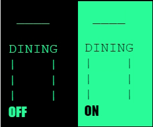
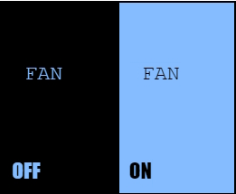
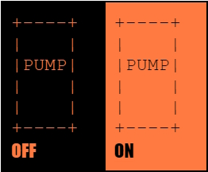
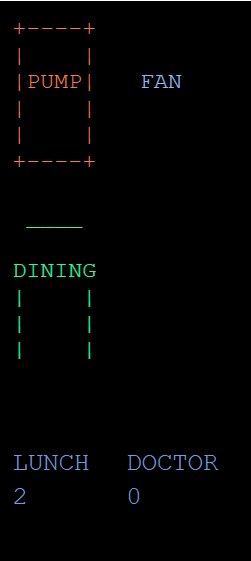

# Universal Light Switch


## Putting It All Together


# Touchscreen calibration

Before the chip is assembled into the enclosure, it needs to be programmed with an Over-The-Air (OTA) program.  It is recommended that this program be XPTcalibrate (current version 07) because this program must be run to calibrate the touch screen.  This program will store the calibration constants into non-volatile memory of the device.


# Configuring topics on the MQTT broker

It is beyond the scope of this document to describe [MQTT](https://info.hivemq.com/mqtt-essentials?utm_source=adwords&utm_campaign=&utm_term=mqtt&utm_medium=ppc&hsa_tgt=kwd-296477891479&hsa_cam=17592177319&hsa_src=g&hsa_net=adwords&hsa_kw=mqtt&hsa_ad=606589589992&hsa_grp=135482495742&hsa_ver=3&hsa_acc=3585854406&hsa_mt=e&gad=1&gclid=CjwKCAiAxreqBhAxEiwAfGfndAy_XN4FWzxc7Q2UM76PWlmbDLIhMVIMw4bQf0E09n3qoP_ruHHxtBoCcDsQAvD_BwE).

Needed is an MQTT client to publish to topics on the MQTT broker.  One can be downloaded from [mosquitto.org](https://mosquitto.org/).  A very useful utility to observe the contents of the MQTT broker is [MQTT Explorer](https://mqtt-explorer.com/).

**All messages to all topics of the ULS must be published with the _retain_ flag set.**  This is to ensure the switches get restored to their previous state after a power loss.

The Universal Light Switch (ULS) requires three topics plus 1 topic for each device.  This is described in [Data Structures](https://docs.google.com/document/d/17SDZbAOWI4VyTK_cv69Re70S6hqNbCYgui9fIHR9RqA/edit#heading=h.jazrh0mlrwol) of [Universal Light Switch: Software ver 49](https://docs.google.com/document/d/17SDZbAOWI4VyTK_cv69Re70S6hqNbCYgui9fIHR9RqA/edit?usp=drive_link). The top level topic is ULS.  Below that will be


* `ULS/panel`
    * <code>ULS/panel/<strong><em>i</em></strong></code> where <strong><em>i</em></strong> is the index number of that panel

        The message in this topic describes the menus and/or activities of that panel.  If the value in this topic is changed, the device will load the panel of that index

* `ULS/menu`
    * <code>ULS/menu/<strong><em>i</em></strong></code> where <strong><em>i</em></strong> is the index number of that menu

        The message in this topic describes which panel to load when they key is pressed, and the label and color of the key

* `ULS/activity`
    * <code>ULS/activity/<strong><em>i</em></strong></code> where <strong><em>i</em></strong> is the index number of that activity
        * The message in this topic is the state of the activity (in Version 49, 0-100)
        * When the key is pressed
            * if the number is zero, the value the number will be changed to the last non-zero value 
            * If the number is non-zero the value the number will be changed to the last zero value 
            * The new value will be published to this topic
            * The appearance of the key will reflect the change.
        * When the value in this topic is changed
            * The new value will be noted
            * The appearance of the key will reflect the change.
    * <code>ULS/activity/<strong><em>i</em></strong>/label</code>

        The message in this topic describes the label and color of the key

* <code>ULS/<strong><em>device</em></strong></code> where <strong><em>device</em></strong> is the last six hexadecimal digits of the MAC address of the device

    The message in this topic describes the the online state of the device

    * <code>ULS/<strong><em>device</em></strong>/version</code>

        Is the version of the software on the device.

    * <code>ULS/<strong><em>device</em></strong>/panel</code>

        This is the value of the index of the current panel in the device.


## What this all means

If a valid panel index is published to the topic <code>ULS/<strong><em>device</em></strong>/panel</code> that panel data will be read into the device.  The panel data is a set of six descriptors, one for each key on the device.  A descriptor is made up of a type and an index, <strong><code><em>i</em></code></strong>.  

Using the descriptor, the device will read configuration information for each key from the appropriate topic.


* If the type is **_a_** (activity), the device will read in the data from the topic <code>ULS/activity/<strong><em>i</em></strong>/label</code> 
* If the type is <strong><em>p</em></strong> (menu), the device will read in the data from the topic <code>ULS/menu/<strong><em>i</em></strong> </code>(for clarification, “menu” is a menu item on the panel which will select another panel)
* If the type is <strong><em>n</em></strong> (nothing), the device will configure the key to do nothing. 


# An example

Let’s say we have three devices that we want to control, a Sonoff D1, a Sonoff Basic R2 and an LLS, custom light switch.  Each of these is an entity or device in Home Assistant.  We want to control these using several ULS’s that are in different locations.

For this example, each device is associated with its own activity, though it would be up to Home Automation to decide which devices are associated with an activity.  The unique identifier for the ULS will be EAFBDC.  It will have a topic `ULS/EAFBDC/panel`.


## Activity

Let’s say the Sonoff D1 is in the dining room.  Let’s set its activity index to 0 (a number from 0 to 254. 255 means “unset”.  The data for the activity that looked like this:


```
{"L":[" ____ ","","DINING","|    |","|    |","|    |"],"C":[40,251,151]}
```


This is a JSON format.  What follows the `L` is the six lines of six characters that make up the label on the display.  **There must be six lines**, but some lines may be blank (`""`) and only the first six characters are used.  This is what the label would look like:



This data would be published to the topic <code>ULS/activity/<strong><em>o</em></strong>/label</code> (the <strong><code><em>o</em></code></strong> is a zero)

The activity must have an initial state.  Thus 0 could be written to the topic <code>ULS/activity/<strong><em>o</em></strong></code>  NOTE: In Version 49 of the software, ON is 100 and OFF is 0.

Similarly the Sonoff Basic R2 for a fan and the data published to <code>ULS/activity/<strong><em>1</em></strong>/label</code>
```
{"L":["",""," FAN","","",""],"C":[132,188,255]}
```


And a pump for the LLS, and the data published to topic <code>ULS/activity/<strong><em>2</em></strong>/label</code>
```
{"L":["+----+","|    |","|PUMP|","|    |","|    |","+----+"],"C":[225,122,64]}
```


## Menu items

Menu items are much the same.  The difference is that the menu item will be selecting another panel so the data must include the index number of a panel that is to be loaded.  These data show that menu item with index 0 will load panel 1, menu item 1 will load panel 2, and menu item 2 will load panel 0.  Note that all menu items are blue.  Also, there is no ON state for menu items.

<span style="text-decoration:underline;">index</span>


1. `{"N":1,"L":["","","BREAK","1","",""],"C":[0,0,255]}`
2. `{"N":2,"L":["","","LUNCH","2","",""],"C":[0,0,255]}`
3. `{"N":0,"L":["","","DOCTOR","0","",""],"C":[0,0,255]}`

These data are published to the topics, <code>ULS/menu/<strong><em>o</em></strong></code>, <code>ULS/menu/<strong><em>1</em></strong></code>, and <code>ULS/menu/<strong><em>2</em></strong></code>, respectively.


## Panels

Panel data describe what the function of each key will perform.  Important notes: each activity must be unique to the panel.  Do not use a menu item that would select the panel of the same index.

<span style="text-decoration:underline;">index</span> 


1. `{"Type":["a","n","n","n","p","p"],"Index":[0,255,255,255,0,2]}`
2. `{"Type":["a","a","n","n","p","p"],"Index":[1,  2,255,255,0,1]}`
3. `{"Type":["a","a","a","n","p","p"],"Index":[2,  1,  0,255,1,2]}`


## Description

Let us say a 2 was published to the panel topic of our ULS  `ULS/EAFBDC/panel`.  The ULS will get the data for the panel with index 2.  It will extract the first type, which is `a`, and the index for that activity, which in this case is also `2`. It will load the label data from the topic <code>ULS/activity/<strong><em>2</em></strong>/label</code> and set these attributes.  It will then subscribe to the topic <code>ULS/activity/<strong><em>2</em></strong></code>, and when that data in that topic changes it will get the data from and act upon it.  Similarly for the second and third <code>a</code>.

The menu items are similar, with two exceptions.  There `N` attribute, which is the panel to load when the key is pressed, will be noted.  There is no value associated with the key.

When all loaded (it may take some time), the panel will look like:


